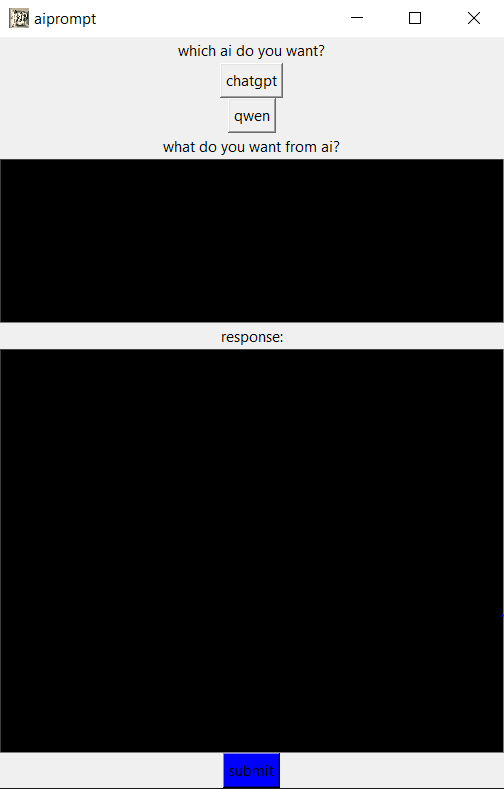

# 🤖 AI Automation Desktop App (Tkinter GUI)
<meta name="google-site-verification" content="ie5JFJaZb89TRxLpotUd0OkPuTBiDxeIahRas2emAOU" />

**A Python desktop application for Windows that automates AI tasks through a simple and responsive Tkinter-based GUI.**


---

## 🧠 Overview

This app uses **Python + Tkinter** to provide a lightweight desktop interface for interacting with and automating AI tasks like:

- Sending prompts to AI models
- Extracting and saving results
- Automating workflows (e.g., summarize text)

You can connect it with APIs like OpenAI, even automate browser-based tools via Selenium (optional).

---

## 🖼️ Screenshot

> *(Add your screenshot in `capture.png`)*

---

## ✨ Features

- 🪟 Native Windows GUI built with Tkinter
- 🧠 Automates AI tasks: text generation, summarization, and more
- 🔌 Supports API-based or web automation (optional)
- 💾 Export AI outputs to files (TXT, HTML)
- 🧩 Easily extendable with new tasks/modules

---

## 📦 Installation

### Requirements

- Windows 10 or 11
- Python 3.8 or newer
- `pip` installed
- new version of google chrome
### Clone & create app by yourself

```bash
git clone https://github.com/automatorplus68-sketch/automation-of-ai.git
cd automation-of-ai
pip install -r requirements.txt
Run the App
bash
Copy code
python main.py
📁 Project Structure
bash
Copy code
📦 [automation-of-ai]
├── aiprompt.py                # Entry point with GUI
├── Capture.PNG     # UI screenshot
├── requirements.txt
└── README.md
🔧 Build Executable (Optional)
To create a standalone .exe for Windows:

bash
Copy code
pip install pyinstaller
pyinstaller --noconfirm --onefile --windowed --icon="path/of/appicon.ico" path/of/aiprompt.py
Output will be generated in the dist/ folder.

🧪 Example Use Cases
Ask AI to generate emails, blogs, or summaries

Paste text and get translations or paraphrased output

Automatically send prompts to multiple AI platforms

🛠 Dependencies
Example requirements.txt:

txt
Copy code
undetected_chromedriver
selenium
requests
pillow
pywinauto
tk  # built-in, but included for completeness
Generate your full list: pip freeze > requirements.txt

🛡 License
This project is licensed under the MIT License. See the LICENSE file for details.

🙌 Credits
OpenAI

Tkinter Docs

Python Community

🤝 Contributing
Feel free to fork the repo and submit a pull request. For bugs or feature suggestions, open an issue and if you had any ideas of automation please share with me.
if you want this desktop app visit my repository
